# 启动
### 启动mysql 
net start mysql80
net stop mysql80
### 进入客户端
mysql -u root -p
# DDL 数据库操作
### 查找
查找所有数据库:
- show databases;
查找当前数据库:
- select database();
### 创建
create database [if not exits] name ;
### 删除
drop database name;
### 使用
use name;
# 表操作 
## 创建
create table t_name(a_name type comment ' ',a_name type comment ' ' )comment ' ';
## 查询
### 查询当前数据库所有表
show tables;
### 查询表结构
desc t_name;
### 查询指定表的建表语句
show creat table t_name;
## 修改
### 添加字段
alter table t_name add Na_name type(num) comment ' '; 
### 修改数据类型
alter table t_name modify a_name Ntype();
### 修改字段名和字段类型
alter table t_name change a_name ra_name type(num) comment ' '
### 删除字段
alter table t_name drop a_name;
### 修改表名
alter table t_name rename to rt_name;
### 删除表
drop table t_name
### 删除指定表，并重新创建该表
truncate table t_name;

# DML 数据操作语言
## 添加数据
### 给指定字段添加数据
insert into t_name() values ();
### 给全部字段添加数据
insert into t_name values ();
### 批量添加数据
inster into t_name() values (),();
inster into t_name values (),();
## 修改数据
update t_name set a_name = '' where 条件;
## 删除数据
delete from t_name where 条件;
# DQL 查询
## 基础查询
select a_name from t_name;
select * from t_nam;
select a_name as '' from t_name;
select distinct a_name from t_name;
## 条件查询
select a_name from t_name where '';

{> >= < <= = <>或!= between..and.. in() (like '_'或'%```') (is null) (is not null) and或&& or或|| not或! }

## 聚合函数
select function(a_name) from t_name ;

{count max min avg sum}
## 分组查询
select a_name from t_name where 条件 group by a_name having 条件;
## 排序查询
select a_name from t_name order by a_name asc/desc , a_name asc/desc ;
## 分页查询 (page-1)*page_num
select a_name from t_name limit page,page_num;
# DCL 数据控制
## 查询用户
use mysql;
select * from user;
## 创建用户
### 访问用户
creat user 'name'@'hostname' identified by 'password';
### root用户
creat user 'name'@'%' identified by 'password';
## 修改用户密码
alter user 'name'@'homstname' identified with mysql_native_password by 'New_password';
## 删除用户
drop user 'name'@'homstname';
## 控制权限

### 查询权限
show grants for 'name'@'homstname';
### 授予权限
grant (grants) on database.name to 'name'@'homstname';
### 撤销权限
revoke (grants) on database.name from 'name'@'homstname';

# 函数
## 字符串

填充字符串
updata t_name set a_name = lpad(a_name,5,' 0' );
## 数值

## 日期
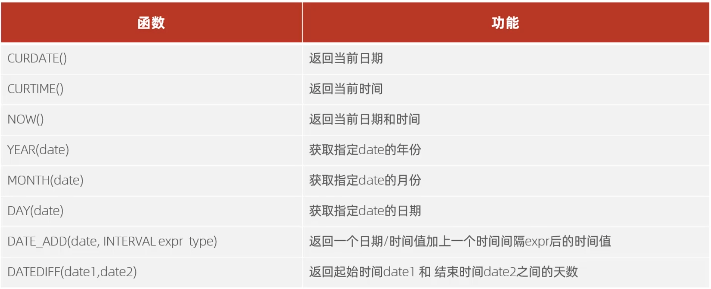
## 流程函数
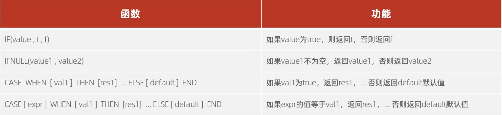
# 外键约束
## 添加
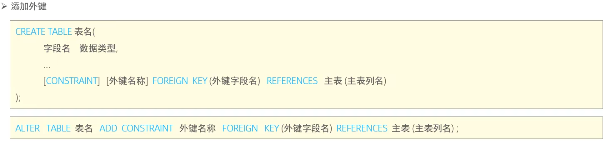
alter table t_name add constraint fk_name foreign key (a_name) references dept(a_name); 
## 删除
alter table t_name drop foreign key fk_name;

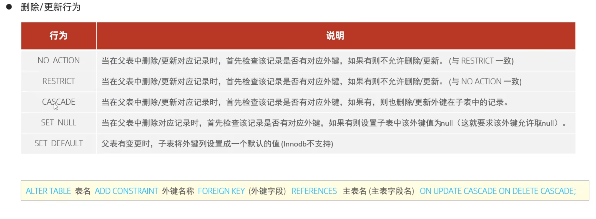

# 多表查询
## 多表关系

### 一对多
creat table t1_name(
    ...
    ...
    fk_t1_name int 
)
creat table t2_name(
    ...
    ...
    fk_t2_name
)
alter table a_name add constraint fk_name foreign key (fk_t1_name) references t1_name (fk_t2_name);
### 多对多
creat table t1_t2_name(
    ...
    ...
    constraint fk_name1 foreign key (t1_fk_name) references t1_name (a_name),
    constraint fk_name2 foreign key (t2_fk_name) references t2_name (a_name)
)
### 一对一
creat table t1_name(
    ...
    ...
    id int auto_increment primary key comment ''
)
creat table t_name(
    ...
    ...
    fk_name int unique comment ' ',
    constraint fk_name foreign key (fk_name) references t1_name (id)
)
## 内连接查询
### 隐式内连接
select a1_name , a2_name from t1_name t1,t2_name t2 where t1.a_name = t2.a_name ; 
### 显示内连接
select a1_name ,a2_name from t1_name t1 inner join t2_name t2 on t1.a_name = t2.a_name ; 

## 外连接
### 左外连接
### 右外连接
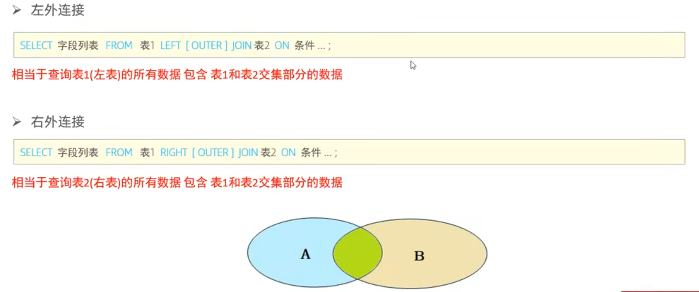

## 自连接


## 联合查询
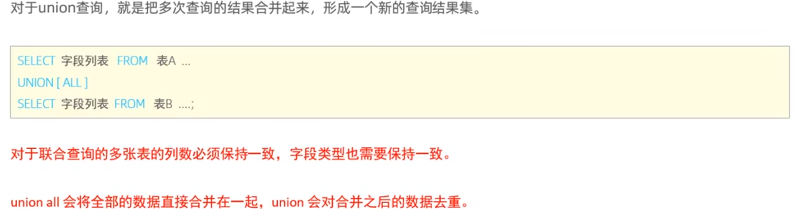

## 子查询
### 标量子查询 

select a1_name from t1_name where fkid_name = (select a2_name from t2_name where id_name = ());
 
### 行子查询

select * from t_name where (a1_name,a2_name) = (select a1_name ,a2_name from t_name where a_name = '');

### 表子查询

select * from t_name where (a1_name,a2_name) in (select a1_name ,a2_name from t_name where a_name = '');

# 事务
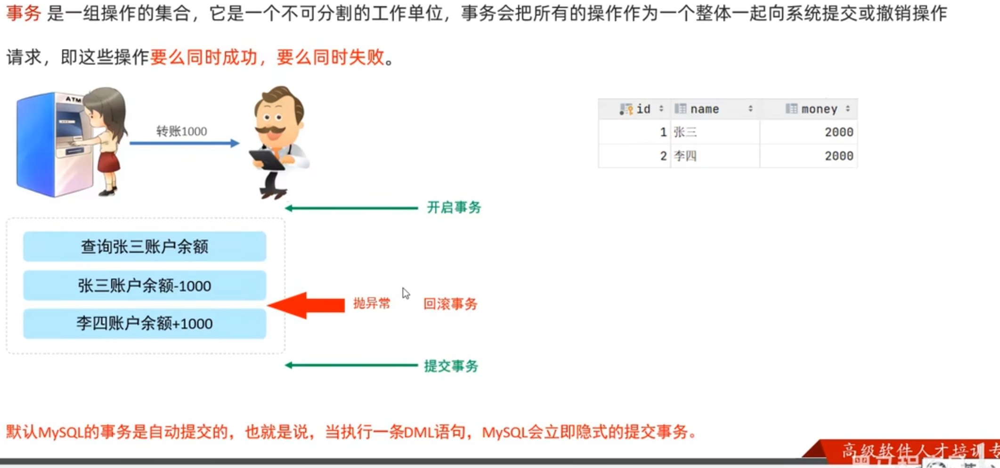

## 并发事务问题
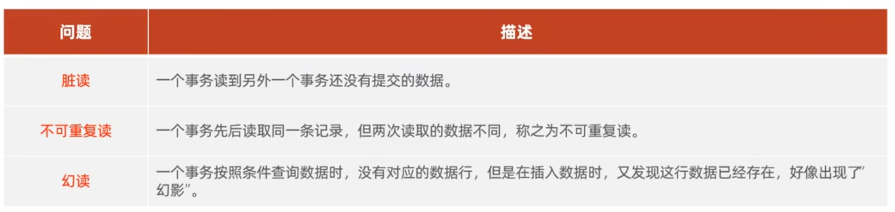

## 事务操作 
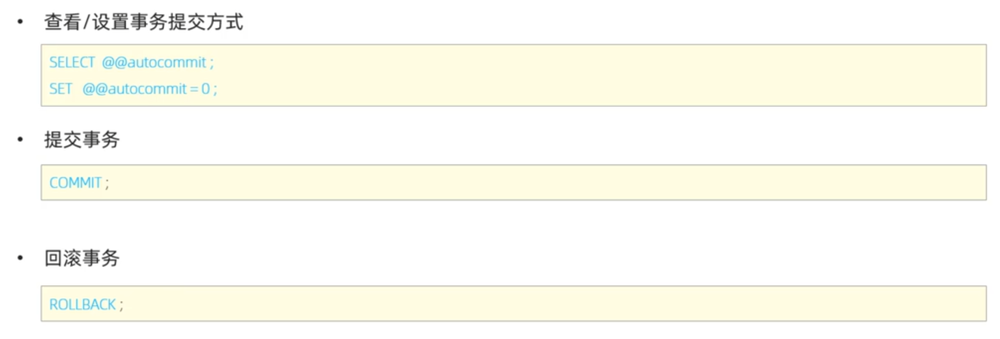
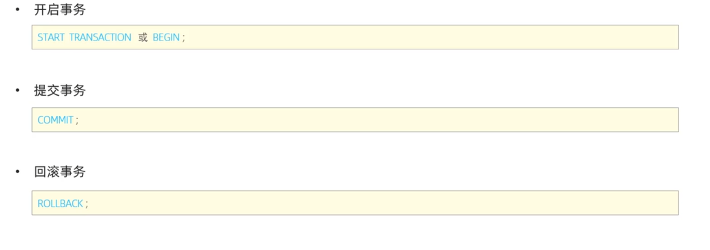

## 事务隔离级别
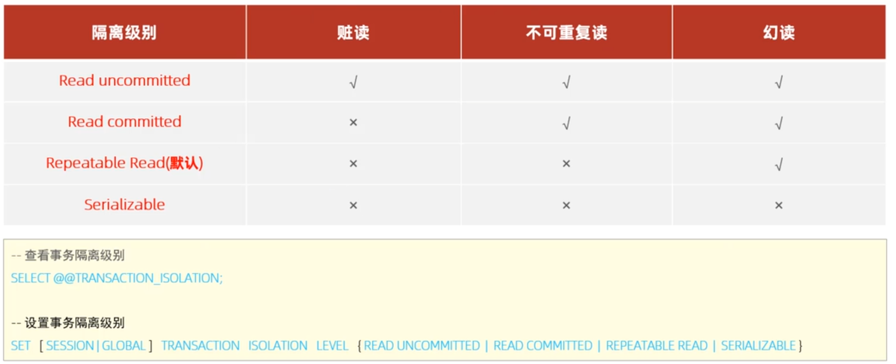